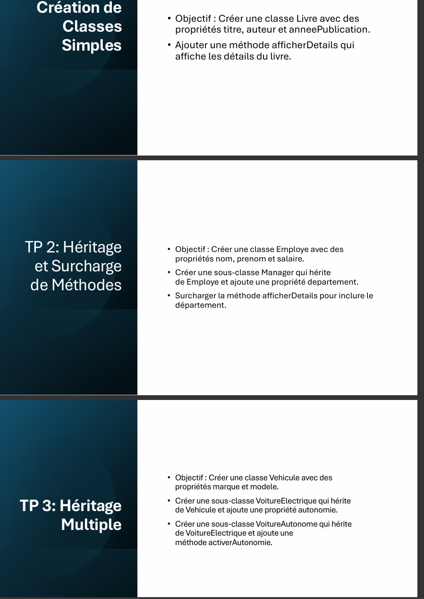

# Object-Oriented Programming (OOP) Lab: Inheritance and Method Overriding (JavaScript Version)

## Description
This project includes several object-oriented programming exercises in JavaScript, demonstrating inheritance, method overriding, and multiple inheritance.

## Objectives
### Lab 1: Book Class
- Create a `Book` class with the following properties:
  - `title`
  - `author`
  - `publicationYear`
- Add a method `displayDetails()` to show the book details.

### Lab 2: Inheritance and Method Overriding
- Create an `Employee` class with the properties:
  - `lastName`
  - `firstName`
  - `salary`
- Create a subclass `Manager` that inherits from `Employee` and adds:
  - A `department` property
  - An overridden `displayDetails()` method to include the department.

### Lab 3: Multiple Inheritance
- Create a `Vehicle` class with the properties:
  - `brand`
  - `model`
- Create a subclass `ElectricCar` that inherits from `Vehicle` and adds:
  - A `range` property
- Create a subclass `AutonomousCar` that inherits from `ElectricCar` and adds:
  - A method `activateAutonomy()`

## Installation and Execution
1. Clone this repository:
   ```bash
   git clone https://github.com/makombelajob/PooJs.git
   ```
2. Navigate to the project folder:
   ```bash
   cd PooJs
   ```

## Screenshot
Include a relevant image for your project:


## Author
- [makombelajob]

## License
This project is licensed under the MIT License. You are free to use and modify it.

